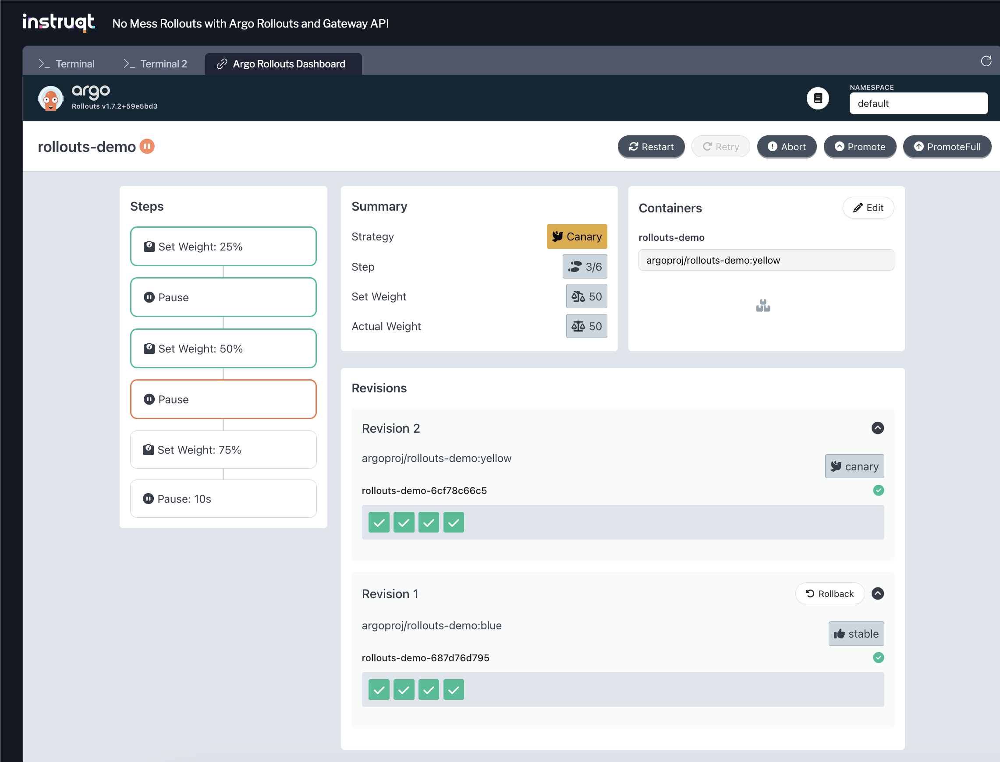

Setup
=====

# Installing Argo Rollouts

In order to use Argo Rollouts, we need to install it! We will use `helm` to install Argoo Rollouts:
```bash,run
helm upgrade --install argo-rollouts argo-rollouts \
  --repo https://argoproj.github.io/argo-helm \
  --version 2.37.6 \
  --namespace argo-rollouts \
  --create-namespace \
  --wait
```

Check it installed correctly:
```bash,run
kubectl get pods -n argo-rollouts
```

Should look something like:
```,nocopy
NAME                             READY   STATUS    RESTARTS   AGE
argo-rollouts-65867bc597-hrh6v   1/1     Running   0          43s
```

## Creating the Rollout

Now let's create a `Rollout` to manage and deploy our demo application.
First we'll see what the file looks like:
```bash,run
bat labs/02/rollout.yaml | yq
```

Now let's apply it:
```bash,run
kubectl apply -f labs/02/rollout.yaml
```

Let's make sure the Rollout was created along with the derived resources:
```bash,run
kubectl get rollouts.argoproj.io,all
```

We should see output similar to:
```,nocopy
NAME                                DESIRED   CURRENT   UP-TO-DATE   AVAILABLE   AGE
rollout.argoproj.io/rollouts-demo   8         8         8            8           48s

NAME                                 READY   STATUS    RESTARTS   AGE
pod/rollouts-demo-687d76d795-5h7kl   1/1     Running   0          47s
pod/rollouts-demo-687d76d795-8swmg   1/1     Running   0          47s
pod/rollouts-demo-687d76d795-dkwff   1/1     Running   0          47s
pod/rollouts-demo-687d76d795-frr94   1/1     Running   0          47s
pod/rollouts-demo-687d76d795-p26f7   1/1     Running   0          47s
pod/rollouts-demo-687d76d795-s455w   1/1     Running   0          47s
pod/rollouts-demo-687d76d795-v2s5s   1/1     Running   0          47s
pod/rollouts-demo-687d76d795-v5nfw   1/1     Running   0          47s

NAME                 TYPE        CLUSTER-IP   EXTERNAL-IP   PORT(S)   AGE
service/kubernetes   ClusterIP   10.96.0.1    <none>        443/TCP   7m21s

NAME                                       DESIRED   CURRENT   READY   AGE
replicaset.apps/rollouts-demo-687d76d795   8         8         8       47s
```

We will see the `Rollout` exists along with the generated `ReplicaSet` and `pods`.
Similar to the K8s `Deployment`, on initial creation of a `Rollout`, the full set of replicas are created and no rollout strategy takes place.

Let's see a bit more detail of these resources and how they map to the `Rollout`.

To do so, we will use the Argo Rollouts kubectl plugin, which has several rollouts-specific features.
The plugin has already been downloaded and placed in our path, so it is ready for use, e.g.:
```bash,run
echo
which kubectl-argo-rollouts
echo
kubectl argo rollouts version
```

Now we can use it to check the `rollout` state:
```bash,run
kubectl argo rollouts get rollout rollouts-demo
```

We see that our rollout is healthy and stable with a single revision.

## Modifying and Promoting the Rollout

Let's update the Rollout.
Similar to the previous example with `Deployments`, we will update the image used in the Pod.
As this modifies the pod spec, it will trigger a rollout.
However, we can't use `kubectl set` because it doesn't understand the `Rollout` resource. We will use the rollouts plugin to handle it:
```bash,run
kubectl argo rollouts set image rollouts-demo rollouts-demo=argoproj/rollouts-demo:yellow
```

Now we can check the status:
```bash,run
kubectl argo rollouts get rollout rollouts-demo
```

We should see output similar to:
```,nocopy
Name:            rollouts-demo
Namespace:       default
Status:          ॥ Paused
Message:         CanaryPauseStep
Strategy:        Canary
  Step:          1/6
  SetWeight:     25
  ActualWeight:  25
Images:          argoproj/rollouts-demo:blue (stable)
                 argoproj/rollouts-demo:yellow (canary)
Replicas:
  Desired:       8
  Current:       8
  Updated:       2
  Ready:         8
  Available:     8

NAME                                       KIND        STATUS     AGE    INFO
⟳ rollouts-demo                            Rollout     ॥ Paused   2m34s
├──# revision:2
│  └──⧉ rollouts-demo-6cf78c66c5           ReplicaSet  ✔ Healthy  16s    canary
│     ├──□ rollouts-demo-6cf78c66c5-9kgfr  Pod         ✔ Running  16s    ready:1/1
│     └──□ rollouts-demo-6cf78c66c5-xk9r9  Pod         ✔ Running  16s    ready:1/1
└──# revision:1
   └──⧉ rollouts-demo-687d76d795           ReplicaSet  ✔ Healthy  2m34s  stable
      ├──□ rollouts-demo-687d76d795-2k8tr  Pod         ✔ Running  2m34s  ready:1/1
      ├──□ rollouts-demo-687d76d795-cwn6s  Pod         ✔ Running  2m34s  ready:1/1
      ├──□ rollouts-demo-687d76d795-kvztt  Pod         ✔ Running  2m34s  ready:1/1
      ├──□ rollouts-demo-687d76d795-f2wf8  Pod         ✔ Running  2m33s  ready:1/1
      ├──□ rollouts-demo-687d76d795-tr4ph  Pod         ✔ Running  2m33s  ready:1/1
      └──□ rollouts-demo-687d76d795-xhbkq  Pod         ✔ Running  2m33s  ready:1/1
```

The `Rollout` has created a new revision and a corresponding `ReplicaSet` which then has spun up pods accordingly.
Revision 1 is still our stable revision but only has 6 replicas, corresponding to a 75% weight.
Revision 2 is now our canary and has 2 replicas or 25% of the desired replica count.
The rollout is also paused for an indefinite amount of time, waiting for manual intervention to promote the rollout to the next step.

Let's check out details of the generated `RelicaSet` before moving on:
```bash,run
kubectl get rs,po --show-labels
```

We can see that the names and hash labels for the 2 replicaSets match the rollout state, and the pods have correct labels according to which revision they are based on.

Now we can promote beyond the paused step, but first let's get organized so we can watch the progress with more feedback.
We will again promote the rollout using the command-line but we will use the `--watch` flag of the `kubectl argo get rollout` to get continuous updates.
Let's run them both now:
```bash,run
kubectl argo rollouts promote rollouts-demo
kubectl argo rollouts get rollout rollouts-demo --watch
```

Now we are paused again for manual promotion.

Let's explore the Rollouts Dashboard and use it to promote the rollout.

The dashboard is available on the main rollouts pod. For our purposes, let's use the CLI plugin command to port-forward to the dashboard.

First, let's switch to [Terminal 2](tab-1) and begin the port forward.
```bash,run
kubectl argo rollouts dashboard
```

The UI should be available in the ["Argo Rollouts Dashboard" tab](tab-2).
Let's poke around the UI and promote the rollout.



Finally we can describe the rollout to see the various events that occurred:
```bash,run
kubectl describe rollout rollouts-demo
```

## Aborting the Rollout

Now let's explore the case when something doesn't go so great.
Let's update our application and watch the canary kick off:
```bash,run
kubectl argo rollouts set image rollouts-demo rollouts-demo=argoproj/rollouts-demo:bad-purple
kubectl argo rollouts get rollout rollouts-demo --watch
```

Now imagine with this new version contains a bug and we start getting reports of various failures, so we need to rollback to the previous working state ASAP.
We can do this by aborting the rollout.
We will use the CLI to abort and watch the progress:
```bash,run
kubectl argo rollouts abort rollouts-demo
kubectl argo rollouts get rollout rollouts-demo --watch
```

We should end up with something like:
```,nocopy
Name:            rollouts-demo
Namespace:       default
Status:          ✖ Degraded
Message:         RolloutAborted: Rollout aborted update to revision 3
Strategy:        Canary
  Step:          0/6
  SetWeight:     0
  ActualWeight:  0
Images:          argoproj/rollouts-demo:yellow (stable)
Replicas:
  Desired:       8
  Current:       8
  Updated:       0
  Ready:         8
  Available:     8

NAME                                       KIND        STATUS        AGE    INFO
⟳ rollouts-demo                            Rollout     ✖ Degraded    17m
├──# revision:3
│  └──⧉ rollouts-demo-599c9c6859           ReplicaSet  • ScaledDown  3m13s  canary
├──# revision:2
│  └──⧉ rollouts-demo-6cf78c66c5           ReplicaSet  ✔ Healthy     15m    stable
│     ├──□ rollouts-demo-6cf78c66c5-9kgfr  Pod         ✔ Running     15m    ready:1/1
│     ├──□ rollouts-demo-6cf78c66c5-xk9r9  Pod         ✔ Running     15m    ready:1/1
│     ├──□ rollouts-demo-6cf78c66c5-8ljwp  Pod         ✔ Running     7m12s  ready:1/1
│     ├──□ rollouts-demo-6cf78c66c5-fmdrt  Pod         ✔ Running     7m12s  ready:1/1
│     ├──□ rollouts-demo-6cf78c66c5-rsdbr  Pod         ✔ Running     4m34s  ready:1/1
│     ├──□ rollouts-demo-6cf78c66c5-tmc5l  Pod         ✔ Running     4m34s  ready:1/1
│     ├──□ rollouts-demo-6cf78c66c5-jr4rm  Pod         ✔ Running     2m44s  ready:1/1
│     └──□ rollouts-demo-6cf78c66c5-mtj8s  Pod         ✔ Running     2m44s  ready:1/1
└──# revision:1
   └──⧉ rollouts-demo-687d76d795           ReplicaSet  • ScaledDown  17m
```

So the canary detected a problem and we were able to revert before exposing 100% of our production users to the bug.
We are now in a state where the rollout has scaled down the new canary (revision 3) and set 100% back to the stable version.
However, because we had to abort, we are in a `Degraded` state.

Let's fix the bug and push out a new version:
```bash,run
kubectl argo rollouts set image rollouts-demo rollouts-demo=argoproj/rollouts-demo:purple
kubectl argo rollouts get rollout rollouts-demo --watch
```

Now things are looking better, and our new canary (revision 4) seems to be working great!
We're so confident in this new version let's forcefully promote it all the way skipping the rest of the steps and pauses:
```bash,run
kubectl argo rollouts promote rollouts-demo --full
kubectl argo rollouts get rollout rollouts-demo --watch
```

 > [!NOTE]
 > Indefinite pauses and manual promotion are great when starting out, as well as for experimentation and demos, but the end goal should be a fully automated solution.
 > In a later challenge we will explore how to automate this failure detection and rollback.

Finish
======

## Cleanup

Let's remove our `Rollout` as we will be starting fresh in the next challenge:
```bash,run
kubectl delete -f labs/02/rollout.yaml
```

Click **Check** to move on to the next lab!
