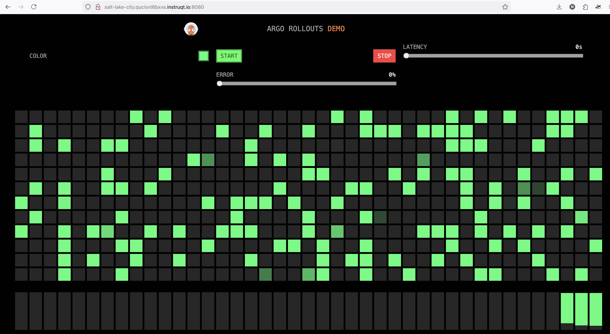
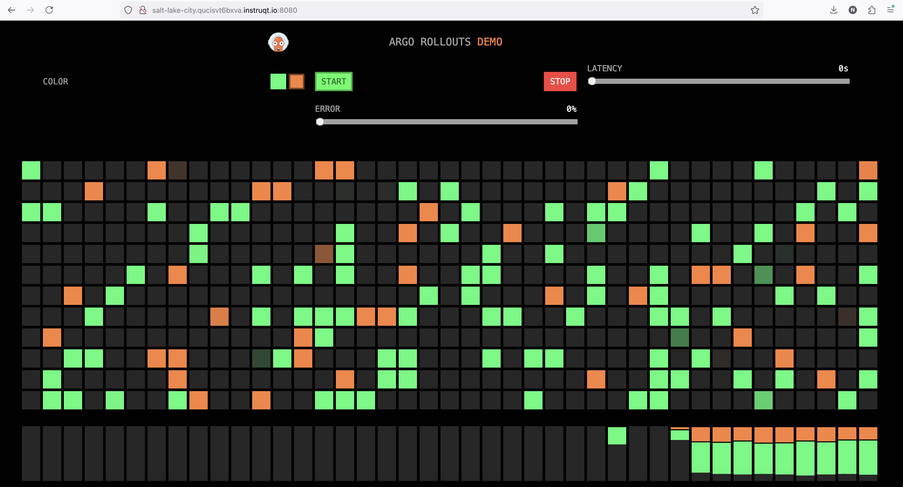
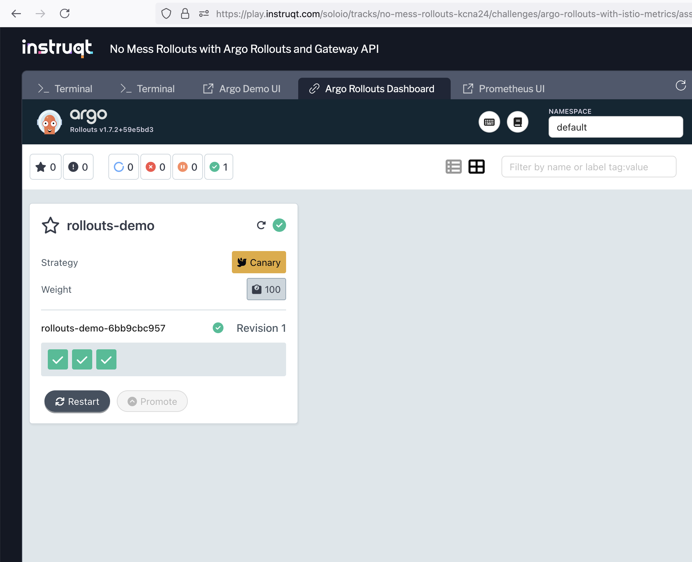

## Setup Argo Rollouts with Gateway API
===============

Remember we can use [Argo Rollouts](https://argoproj.github.io/rollouts/) as a declarative progressive delivery tool for Kubernetes to update applications gradually, using a blue/green or canary strategy to manage the rollout.

1. Run the following commands to install Argo Rollouts in your environment with the Kubernetes Gateway API plugin:

```bash,run
helm upgrade --install argo-rollouts argo-rollouts \
  --repo https://argoproj.github.io/argo-helm \
  --version 2.37.6 \
  --namespace argo-rollouts \
  --create-namespace \
  --wait \
  -f -<<EOF
controller:
  trafficRouterPlugins:
    trafficRouterPlugins: |-
      - name: "argoproj-labs/gatewayAPI"
        location: "https://github.com/argoproj-labs/rollouts-plugin-trafficrouter-gatewayapi/releases/download/v0.3.0/gateway-api-plugin-linux-amd64"
EOF
```

2. Change the Argo Rollouts config map to install the Argo Rollout Gateway API Plugin.

```bash,run
bat labs/05/configmap.yaml | yq
```

Notice the `trafficRouterPlugins` is using the gateway API plugin.

Apply the config:
```bash,run
kubectl replace -f labs/05/configmap.yaml
```

3. Restart the Argo Rollouts pod for the plug-in to take effect.
```bash,run
kubectl rollout restart deployment -n argo-rollouts argo-rollouts
```

4. Create a ClusterRole to allow the Argo Rollouts pod to manage HTTPRoute resources.

A [ClusterRole](https://kubernetes.io/docs/reference/access-authn-authz/rbac/#role-and-clusterrole) in Kubernetes is a cluster-wide resource that defines a set of permissions (rules) for accessing resources within a Kubernetes cluster. These permissions can include actions like get, list, create, delete, etc., on various resources such as pods, services, and nodes. Unlike a Role, which is restricted to a single namespace, a ClusterRole can apply either across all namespaces or to cluster-wide resources that are not namespaced.

```bash,run
bat labs/05/clusterrole.yaml | yq
```

This provides permissions for Argo Rollouts to update the HTTPRoute with the correct weights.

Apply the config:
```bash,run
kubectl apply -f labs/05/clusterrole.yaml
```

5. Create a ClusterRoleBinding to give the Argo Rollouts service account the permissions from the cluster role.

A [ClusterRoleBinding](https://kubernetes.io/docs/reference/access-authn-authz/rbac/#rolebinding-and-clusterrolebinding) is a Kubernetes resource that associates a ClusterRole (which defines a set of permissions) with one or more subjects (users, groups, or service accounts) at the cluster-wide level. This allows those subjects to perform specific actions across all namespaces within the cluster, based on the permissions defined in the ClusterRole.

```bash,run
bat labs/05/clusterrolebinding.yaml | yq
```

Apply the config:
```bash,run
kubectl apply -f labs/05/clusterrolebinding.yaml
```

## Argo Rollout
===============

Now we're ready to use Argo Rollouts to progressively update applications as part of continuous delivery.

We're going to use Argo Rollouts with Gateway APIs to gradually deliver an upgraded version of the `rollouts-demo` application from before.

To do this, we'll define a resource that lets Argo Rollouts know how we want it to handle updates to our application,
upgrade the application itself, and then step through the stages of the rollout and see how it interacts with our gateway resources.

1. First, we need to create the application we want to route to.

We'll use the same demo app services and simple HTTPRoute we've used in the previous steps:
```bash,run
kubectl apply -f labs/05/services.yaml
kubectl apply -f labs/05/argo-httproute.yaml
```

Verify the HTTPRoute was created:
```bash,run
kubectl describe httproute argo-rollouts-http-route
```

You should see the HTTPRoute with a status based on the controller:
```yaml,nocopy
Status:
  Parents:
    Conditions:
      Last Transition Time:  2024-11-05T15:01:43Z
      Message:
      Observed Generation:   1
      Reason:                Accepted
      Status:                True
      Type:                  Accepted
      Last Transition Time:  2024-11-05T15:01:43Z
      Message:
      Observed Generation:   1
      Reason:                ResolvedRefs
      Status:                True
      Type:                  ResolvedRefs
    Controller Name:         solo.io/gloo-gateway
    Parent Ref:
      Group:  gateway.networking.k8s.io
      Kind:   Gateway
      Name:   gw
```

2. Next, we need to create an Argo Rollouts [`Rollout`](https://argo-rollouts.readthedocs.io/en/stable/features/specification/) resource. This resource will specify the version of the application, enabling us to perform managed rollouts.

Let's take a look at our rollout:
```bash,run
bat labs/05/rollout.yaml | yq
```

In the rollout.yaml file, we have set `replicas: 3`, which means we expect three replicas of our application to be created. For this lab, we are using the image `argoproj/rollouts-demo:green`, which will allow us to visualize the rollout process.

Apply the rollout:
```bash,run
kubectl apply -f labs/05/rollout.yaml
```

3. After applying the rollout, monitor the status of your application.

Take a look at the `stable` Kubernetes service now that the Rollout has been updated:
```bash,run
kubectl get svc rollouts-demo-stable -oyaml | yq
```

Notice the selector under the service spec is now updated:
```,nocopy
  selector:
    app: rollouts-demo
    rollouts-pod-template-hash: 86666d6ffc
```

We can also use the `kubectl argo` plugin to view the rollout status:
```bash,run
kubectl argo rollouts get rollout rollouts-demo
```

You should see the status of the rollout with only one revision:
```,nocopy
Name:            rollouts-demo
Namespace:       default
Status:          ✔ Healthy
Strategy:        Canary
  Step:          6/6
  SetWeight:     100
  ActualWeight:  100
Images:          argoproj/rollouts-demo:green (stable)
Replicas:
  Desired:       3
  Current:       3
  Updated:       3
  Ready:         3
  Available:     3

NAME                                       KIND        STATUS     AGE    INFO
⟳ rollouts-demo                            Rollout     ✔ Healthy  2m56s
└──# revision:1
   └──⧉ rollouts-demo-7d9c645dbb           ReplicaSet  ✔ Healthy  76s    stable
      ├──□ rollouts-demo-7d9c645dbb-5vfr6  Pod         ✔ Running  76s    ready:1/1
      ├──□ rollouts-demo-7d9c645dbb-k8vhv  Pod         ✔ Running  76s    ready:1/1
      └──□ rollouts-demo-7d9c645dbb-s2ffr  Pod         ✔ Running  76s    ready:1/1
```

Test the rollout works by sending a curl request through the gateway:
```bash,run
export GW_NAMESPACE=default
export GW_ADDRESS=$(kubectl get svc -n $GW_NAMESPACE gw-istio -o jsonpath='{.status.loadBalancer.ingress[0].ip}')
for i in {1..100}; do
  curl "$GW_ADDRESS:80/color"
  echo
done
```

You should see a series of "green" only responses:
```,nocopy
"green"
"green"
"green"
"green"
"green"
"green"
```

4. Access the Demo Page

Once all pods are running and ready, you can access the Argo Rollouts demo page in the Instruqt tab by port-forwarding. Let's switch to [Terminal 2](tab-1) and begin the port forward.

```bash,run
kubectl port-forward svc/gw-istio -n default 8080:80 --address 0.0.0.0
```

Then the Argo Demo page should display:


## Perform a Canary Upgrade
===============

Now we are ready to deploy a new version!

1. We need to edit the Argo Rollouts resource we previously created.

Let's take a look at our new canary rollout:
```bash,run
git -P diff --no-index labs/05/rollout.yaml labs/05/canary-rollout.yaml
```

The new rollout will use the `argoproj/rollouts-demo:orange` image in the template.

Note the steps for the rollout:
```,nocopy
      steps:
      - setWeight: 30
      - pause: {}
      - setWeight: 60
      - pause: {}
      - setWeight: 100
      - pause: {}
```

We also specify `pause: {}` to set an indefinite pause as part of this lab to be able to manually confirm the Rollout is progressing as expected. In the previous example we used `pause: { duration: 30s }` to specify a pause duration so the rollout automatically progressed after the pause duration. This time we will need to manually promote the rollout.

Apply the following command:
```bash,run
kubectl apply -f labs/05/canary-rollout.yaml
```

2. View the status of the rollout with the `kubectl argo` plugin

```bash,run
kubectl argo rollouts get rollout rollouts-demo
```

You should see the status of the canary rollout for the second revision:
```shell,nocopy
Name:            rollouts-demo
Namespace:       default
Status:          ॥ Paused
Message:         CanaryPauseStep
Strategy:        Canary
  Step:          1/6
  SetWeight:     30
  ActualWeight:  30
Images:          argoproj/rollouts-demo:green (stable)
                 argoproj/rollouts-demo:orange (canary)
Replicas:
  Desired:       3
  Current:       4
  Updated:       1
  Ready:         4
  Available:     4

NAME                                       KIND        STATUS     AGE    INFO
⟳ rollouts-demo                            Rollout     ॥ Paused   10m
├──# revision:2
│  └──⧉ rollouts-demo-6cf78c66c5           ReplicaSet  ✔ Healthy  8s     canary
│     └──□ rollouts-demo-6cf78c66c5-zhq6t  Pod         ✔ Running  8s     ready:1/1
└──# revision:1
   └──⧉ rollouts-demo-7d9c645dbb           ReplicaSet  ✔ Healthy  8m37s  stable
      ├──□ rollouts-demo-7d9c645dbb-5vfr6  Pod         ✔ Running  8m37s  ready:1/1
      ├──□ rollouts-demo-7d9c645dbb-k8vhv  Pod         ✔ Running  8m37s  ready:1/1
      └──□ rollouts-demo-7d9c645dbb-s2ffr  Pod         ✔ Running  8m37s  ready:1/1
```

3. View the HTTPRoute

After applying your Argo Rollout configuration, Argo will update the routing in the HTTPRoute. You can confirm that your rollout is configured correctly and observe any changes in traffic distribution between your services by inspecting the HTTPRoute:

```bash,run
kubectl get httproute -o yaml | yq
```

You should see the weights on the backendRefs change from the original:
```yaml,nocopy
  spec:
    parentRefs:
    - group: gateway.networking.k8s.io
      kind: Gateway
      name: gw
    rules:
    - backendRefs:
      - group: ""
        kind: Service
        name: rollouts-demo-stable
        port: 80
        weight: 70
      - group: ""
        kind: Service
        name: rollouts-demo-canary
        port: 80
        weight: 30
      matches:
      - path:
          type: PathPrefix
          value: /
```

The `backendRefs` section lists the backend services that will receive traffic. In this example, there are two services:
- `rollouts-demo-stable`: Assigned a weight of 70. This indicates that 70% of the traffic will be directed to this service.
- `rollouts-demo-canary`: Assigned a weight of 30, meaning it will receive 30% of the traffic.

The weights specified in the `backendRefs` allow for controlled traffic distribution between the stable and canary versions of your application. This is particularly useful during a rollout, as it enables you to gradually shift traffic from the stable version to the canary version, facilitating testing and minimizing the impact of potential issues.

Test the rollout works by sending a curl request through the gateway:
```bash,run
for i in {1..100}; do
  curl "$GW_ADDRESS:80/color"
  echo
done
```

You should see a mix of "orange" and "green" responses now:
```,nocopy
"green"
"green"
"orange"
"green"
"green"
"orange"
```

4. Promote the Rollout to move past the pause step and continue the deployment.

In order to continue after the `pause` step, we need to promote the rollout. You can use the kubectl argo plugin to do this:
```bash,run
kubectl argo rollouts promote rollouts-demo
```

Check the rollout status again to check what step we are on:
```bash,run
kubectl argo rollouts get rollout rollouts-demo
```

***Question***: Based on the rollout status, what are the weights on the HTTPRoute now?

You will need to run the `promote` command one more time to fully promote the argo rollout to the canary version.

Wait a bit until the old color pods are completely destroyed. The demo application UI should gradually change now to orange.



You can confirm this manually by sending the same curl request through the gateway as before:
```bash,run
for i in {1..100}; do
  curl "$GW_ADDRESS:80/color"
  echo
done
```

You should get only "orange" responses once the canary version is promoted:
```,nocopy
"orange"
"orange"
"orange"
"orange"
"orange"
"orange"
```

100% of our traffic should now be being routed to the canary, and none to the stable version. Let's check the HTTPRoute again to see this in effect.

```bash,run
kubectl get httproute -o yaml
```

One final promotion of the rollout will get us back to the completed state, where we have a single pod running the new image; all traffic is being routed to it through the stable service; and both the stable and canary services will be selecting the new pod. Let's get to that state now:
```bash,run
kubectl argo rollouts promote rollouts-demo
```

***Note***: Remember, you can also use the Argo UI to promote the rollouts-demo.

Check the rollout status one last time:
```bash,run
kubectl argo rollouts get rollout rollouts-demo
```

After a short delay, the canary will be scaled down and the rollout of the new version of our application will be completed:
```,nocopy
Name:            rollouts-demo
Namespace:       default
Status:          ✔ Healthy
Strategy:        Canary
  Step:          6/6
  SetWeight:     100
  ActualWeight:  100
Images:          argoproj/rollouts-demo:green
                 argoproj/rollouts-demo:orange (stable)
Replicas:
  Desired:       3
  Current:       6
  Updated:       3
  Ready:         6
  Available:     6

NAME                                       KIND        STATUS     AGE    INFO
⟳ rollouts-demo                            Rollout     ✔ Healthy  12m
├──# revision:2
│  └──⧉ rollouts-demo-6cf78c66c5           ReplicaSet  ✔ Healthy  2m42s  stable
│     ├──□ rollouts-demo-6cf78c66c5-zhq6t  Pod         ✔ Running  2m42s  ready:1/1
│     ├──□ rollouts-demo-6cf78c66c5-ds975  Pod         ✔ Running  81s    ready:1/1
│     └──□ rollouts-demo-6cf78c66c5-lwz65  Pod         ✔ Running  23s    ready:1/1
└──# revision:1
   └──⧉ rollouts-demo-7d9c645dbb           ReplicaSet  ✔ Healthy  11m    delay:27s
      ├──□ rollouts-demo-7d9c645dbb-5vfr6  Pod         ✔ Running  11m    ready:1/1
      ├──□ rollouts-demo-7d9c645dbb-k8vhv  Pod         ✔ Running  11m    ready:1/1
      └──□ rollouts-demo-7d9c645dbb-s2ffr  Pod         ✔ Running  11m    ready:1/1
```

# Argo UI Dashboard

The Argo Rollouts Kubectl plugin can serve a local UI Dashboard to visualize your Rollouts.

To view the Argo Rollouts Dashboard UI, switch to [Terminal 2](tab-1) and run the following command in the namespace that contains your Rollouts:
```bash,run
kubectl argo rollouts dashboard
```



Advanced Task: Define a Route for Early-Adopter Traffic 💪
===============

Similarly to how we used the VirtualService to route to a specific service based on the header, we can do the same configuration using an HTTPRoute.

Create an Argo rollout for two valid versions with a `pause` for testing.

Using the Argo Rollout resource, define an HTTPRoute that matches users who want early access, such as internal users identified by a header `x-rollout-canary: true`. Route these users to the v2 service.

**Hint**: The Argo Rollout resource supports `setHeaderRoute`:
```,nocopy
      steps:
      - setWeight: 10
      - setHeaderRoute:
          name: v2
          match:
            - headerName: x-rollout-canary
              headerValue:
                exact: true
      - pause: {}
```

You can test your Rollout is working by checking the canary color is returned consistently when the header is present:
```bash,run
for i in {1..100}; do
  curl "$GW_ADDRESS:80/color" -H "x-rollout-canary: true"
  echo
done
```

What do you expect the HTTPRoute to look like with the added `x-rollout-canary` header?
```bash,run
kubectl get httproute -oyaml
```

Without the header, the rollout should load-balance between the canary and stable color until the canary version is fully promoted.

🏁 Finish
=========

In this example, we used manual intervention to check the status of our rollout. Next we are going to use the pauses to perform analysis on the canary versions to make sure the new version is working and performant, with the option to automatically promote or abort rollouts based on Istio metrics.

Clean up the HTTPRoute and Rollout:
```bash,run
kubectl delete -f labs/05/services.yaml
kubectl delete -f labs/05/argo-httproute.yaml
```