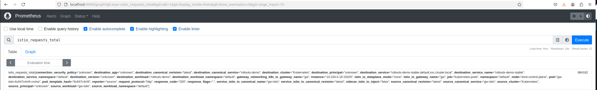
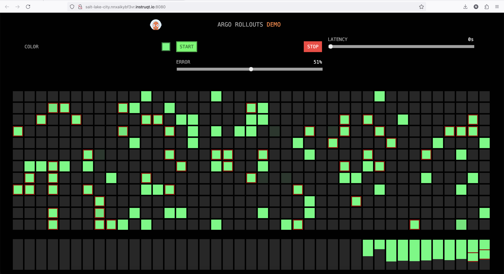

Next we will explore how Argo Rollouts can support metrics based analysis for rollouts.

One thing to consider with metrics-based analysis is that the underlying provider must emit sufficient metrics. Not all providers emit the same metrics, so the analysis needs to be provider specific even though the routing resources are the same.

Istio provides rich metrics which integrate with Argo's analysis tools which we will use in the next section.

## Install Prometheus
===============

Create a namespace for Prometheus and apply the configuration:
```bash,run
kubectl create ns prometheus
kubectl apply -f labs/06/prometheus.yaml
```

Wait for prometheus to be ready:
```bash,run
kubectl rollout status -n prometheus deployment/prometheus --timeout 2m
```

Let's explore what metrics Istio provides. Switch to [Terminal 2](tab-1) and port-forward the prometheus service using `istioctl`:
```bash,run
istioctl dashboard prometheus -n prometheus --browser=false --address 0.0.0.0
```

First let's create the app we want to route to.
We'll use the same demo app and services we've used in the previous steps:
```bash,run
kubectl apply -f labs/06/services.yaml
kubectl apply -f labs/06/rollout.yaml
kubectl apply -f labs/06/argo-httproute.yaml
```

Then send some traffic to generate some Istio metrics:
```bash,run
export GW_NAMESPACE=default
export GW_ADDRESS=$(kubectl get svc -n $GW_NAMESPACE gw-istio -o jsonpath='{.status.loadBalancer.ingress[0].ip}')
for i in {1..100}; do
  curl "$GW_ADDRESS:80/color"
  echo
done
```

Execute a simple Prometheus query by going to the “Expression” input box at the top of the prometheus web page and entering the text:

```
istio_requests_total
```

You should see something like:



Where the query includes information on the source, destination and response code:
```json,nocopy
istio_requests_total{connection_security_policy="unknown", destination_app="unknown", destination_canonical_revision="latest", destination_canonical_service="rollouts-demo", destination_cluster="Kubernetes", destination_principal="unknown", destination_service="rollouts-demo-stable.default.svc.cluster.local", destination_service_name="rollouts-demo-stable", destination_service_namespace="default", destination_version="unknown", destination_workload="rollouts-demo", destination_workload_namespace="default", gateway_networking_k8s_io_gateway_name="gw", instance="10.244.0.18:15020", istio_io_dataplane_mode="none", istio_io_gateway_name="gw", job="kubernetes-pods", namespace="default", node="kind-control-plane", pod="gw-istio-6c647c4cf4-rxvhw", pod_template_hash="6c647c4cf4", reporter="source", request_protocol="http", response_code="200", response_flags="-", service_istio_io_canonical_name="gw-istio", service_istio_io_canonical_revision="latest", sidecar_istio_io_inject="false", source_canonical_revision="latest", source_canonical_service="gw-istio", source_cluster="Kubernetes", source_principal="unknown", source_workload="gw-istio", source_workload_namespace="default"}
```

Next try this query to view the total number of non `5xx` requests:
```
istio_requests_total{
            reporter="source",
            destination_service=~"rollouts-demo-stable.default.svc.cluster.local",
            response_code!~"5.*"}
```

## Increase Error Rate
===============

Let's add some chaos to our system!

First port-forward:
```bash,run
kubectl port-forward svc/gw-istio -n $GW_NAMESPACE 8080:80 --address 0.0.0.0
```

Open the Argo demo UI and increase the error rate.




Next, re-run the prometheus query in the Prometheus UI. You should see now the total is increased. You can calculate the ratio of non-5xx requests to total requests to the `rollouts-demo-stable` with:

```
sum(irate(istio_requests_total{
            reporter="source",
            destination_service=~"rollouts-demo-stable.default.svc.cluster.local",
            response_code!~"5.*"}[40s])
          )
          /
          sum(irate(istio_requests_total{
            reporter="source",
            destination_service=~"rollouts-demo-stable.default.svc.cluster.local"}[40s])
          )
```

Revert the error rate back to zero. Next we will use this Prometheus query to create an  rule for our Argo Rollback to check.

## Create an Analysis Template
===============

While the rollout will traverse through the steps of shifting the traffic by updating the weights, we'll now add an analysis to run as part of the canary deployment. This analysis step can query prometheus for metrics and determine if the new version is running as expected. Argo provides a [AnalysisTemplate](https://argoproj.github.io/argo-rollouts/features/analysis/) resource which defines how to perform a canary analysis, such as the metrics which it should perform, its frequency, and the values which are considered successful or failed.

Let's take a look at the config:
```bash,run
cat labs/06/istio-analysis-template.yaml | yq
```

Notice the prometheus query we're using to perform the analysis is the same query we tested earlier:
```,nocopy
  metrics:
  - name: success-rate
    initialDelay: 30s
    interval: 20s
    successCondition: result[0] > 0.95
    provider:
      prometheus:
        address: http://prometheus.prometheus:9090
        query: >+
          sum(irate(istio_requests_total{
            reporter="source",
            destination_service=~"{{args.service}}.{{args.namespace}}.svc.cluster.local",
            response_code!~"5.*"}[40s])
          )
          /
          sum(irate(istio_requests_total{
            reporter="source",
            destination_service=~"{{args.service}}.{{args.namespace}}.svc.cluster.local"}[40s])
          )
```

The above query is checking to see if the requests per second that are successful (response code not equal `5xx`) drops below successCondition of 95%. If the successful requests fall below this threshold, the analysis will fail, prompting a rollback to the previous stable version.

Apply the config:
```bash,run
kubectl apply -f labs/06/istio-analysis-template.yaml
```

## Monitor Rollouts for Successful Canary
===============

Let's take a look at the config:
```bash,run
cat labs/06/istio-metrics-rollout-good.yaml | yq
```

Notice we are now using the analysis template under the `canary` strategy:
```yaml,nocopy
      analysis:
        startingStep: 1  # When to start the analysis
        templates:
          - templateName: istio-success-rate
        args:             # Arguments to reuse in AnalysisTemplates
          - name: service
            value: rollouts-demo-canary
          - name: namespace
            valueFrom:
              fieldRef:
                fieldPath: metadata.namespace
```

In order for our analysis to work, we need to simulate user traffic through the gateway so that Istio metrics are generated. Open [Terminal 2](tab-1), stop the prometheus port-forward and run:
```bash,run
export GW_NAMESPACE=default
export GW_ADDRESS=$(kubectl get svc -n $GW_NAMESPACE gw-istio -o jsonpath='{.status.loadBalancer.ingress[0].ip}')
for i in {1..10000}; do
  curl "$GW_ADDRESS:80/color"
  echo
done
```

Deploy your rollout with metrics configured to collect data from Prometheus:
```bash,run
kubectl apply -f labs/06/istio-metrics-rollout-good.yaml
```

This will trigger Argo to create an `AnalysisRun`. View the created `AnalysisRun`:
```bash,run
kubectl get analysisrun
```

You should get something that looks like:
```,nocopy
NAME                         STATUS    AGE
rollouts-demo-6bb9cbc957-2   Running   6s
```

Check the progress of the rollout using the `kubectl argo` plugin:
```bash,run
kubectl argo rollouts get rollout rollouts-demo
```

You should get something that looks like this during the steps:
```,nocopy
Name:            rollouts-demo
Namespace:       default
Status:          ॥ Paused
Message:         CanaryPauseStep
Strategy:        Canary
  Step:          1/6
  SetWeight:     30
  ActualWeight:  30
Images:          argoproj/rollouts-demo:purple (canary)
                 argoproj/rollouts-demo:yellow (stable)
Replicas:
  Desired:       3
  Current:       4
  Updated:       1
  Ready:         4
  Available:     4

NAME                                       KIND         STATUS     AGE    INFO
⟳ rollouts-demo                            Rollout      ॥ Paused   4m19s
├──# revision:2
│  ├──⧉ rollouts-demo-6bb9cbc957           ReplicaSet   ✔ Healthy  30s    canary
│  │  └──□ rollouts-demo-6bb9cbc957-cwnmg  Pod          ✔ Running  30s    ready:1/1
│  └──α rollouts-demo-6bb9cbc957-2         AnalysisRun  ◌ Running  28s
└──# revision:1
   └──⧉ rollouts-demo-6cf78c66c5           ReplicaSet   ✔ Healthy  4m17s  stable
      ├──□ rollouts-demo-6cf78c66c5-k6hmt  Pod          ✔ Running  4m17s  ready:1/1
      ├──□ rollouts-demo-6cf78c66c5-tf8sj  Pod          ✔ Running  4m17s  ready:1/1
      └──□ rollouts-demo-6cf78c66c5-v6cxp  Pod          ✔ Running  4m17s  ready:1/1
```

Eventually the rollout will finish if the analysis was successful:
```,nocopy
Name:            rollouts-demo
Namespace:       default
Status:          ✔ Healthy
Strategy:        Canary
  Step:          6/6
  SetWeight:     100
  ActualWeight:  100
Images:          argoproj/rollouts-demo:green
                 argoproj/rollouts-demo:purple (stable)
Replicas:
  Desired:       3
  Current:       6
  Updated:       3
  Ready:         6
  Available:     6

NAME                                       KIND         STATUS        AGE   INFO
⟳ rollouts-demo                            Rollout      ✔ Healthy     2m1s
├──# revision:2
│  ├──⧉ rollouts-demo-6bb9cbc957           ReplicaSet   ✔ Healthy     106s  stable
│  │  ├──□ rollouts-demo-6bb9cbc957-5bx59  Pod          ✔ Running     106s  ready:1/1
│  │  ├──□ rollouts-demo-6bb9cbc957-lcgpx  Pod          ✔ Running     75s   ready:1/1
│  │  └──□ rollouts-demo-6bb9cbc957-mtmb8  Pod          ✔ Running     44s   ready:1/1
│  └──α rollouts-demo-6bb9cbc957-2         AnalysisRun  ✔ Successful  105s  ✔ 4
└──# revision:1
   └──⧉ rollouts-demo-7d9c645dbb           ReplicaSet   ✔ Healthy     2m1s  delay:16s
      ├──□ rollouts-demo-7d9c645dbb-hrj7z  Pod          ✔ Running     2m    ready:1/1
      ├──□ rollouts-demo-7d9c645dbb-xrmdv  Pod          ✔ Running     2m    ready:1/1
      └──□ rollouts-demo-7d9c645dbb-zxgr9  Pod          ✔ Running     2m    ready:1/1
```

When the analysis run is complete you be able to run:
```bash,run
kubectl get analysisrun
```

The STATUS should be updated to `Successful`:
```,nocopy
NAME                         STATUS       AGE
rollouts-demo-6bb9cbc957-2   Successful   92s
```

You can view the result of the analysis by looking at the status:
```bash,run
kubectl describe analysisrun
```

It should look something like this:
```,nocopy
Status:
  Completed At:  2024-11-12T23:26:17Z
  Dry Run Summary:
  Message:  Run Terminated
  Metric Results:
    Count:  4
    Measurements:
      Finished At:  2024-11-12T23:25:15Z
      Phase:        Successful
      Started At:   2024-11-12T23:25:15Z
      Value:        [1]
      Finished At:  2024-11-12T23:25:35Z
      Phase:        Successful
      Started At:   2024-11-12T23:25:35Z
      Value:        [1]
      Finished At:  2024-11-12T23:25:55Z
      Phase:        Successful
      Started At:   2024-11-12T23:25:55Z
      Value:        [1]
      Finished At:  2024-11-12T23:26:15Z
      Phase:        Successful
      Started At:   2024-11-12T23:26:15Z
      Value:        [1]
    Metadata:
      Resolved Prometheus Query:  sum(irate(istio_requests_total{
  reporter="source",
  destination_service=~"rollouts-demo-canary.default.svc.cluster.local",
  response_code!~"5.*"}[40s])
) / sum(irate(istio_requests_total{
  reporter="source",
  destination_service=~"rollouts-demo-canary.default.svc.cluster.local"}[40s])
)

    Name:        success-rate
    Phase:       Successful
    Successful:  4
  Phase:         Successful
  Run Summary:
    Count:       1
    Successful:  1
  Started At:    2024-11-12T23:24:45Z
Events:
  Type    Reason                 Age   From                 Message
  ----    ------                 ----  ----                 -------
  Normal  MetricSuccessful       28s   rollouts-controller  Metric 'success-rate' Completed. Result: Successful
  Normal  AnalysisRunSuccessful  28s   rollouts-controller  Analysis Completed. Result: Successful
```

You can manually confirm the rollout has switched to the canary version by sending some requests:
```bash,run
for i in {1..100}; do
  curl "$GW_ADDRESS:80/color"
  echo
done
```

You should get something like:
```,nocopy
"purple"
"purple"
"purple"
"purple"
```

## Automatic Rollback
===============

But what happens when things go wrong?

Uh-oh! It turns out the next version we are going to upgrade has a regression (We will be using a high error rate images, prefixed with the word `bad`, in this case `bad-yellow`):
```bash,run
kubectl argo rollouts set image rollouts-demo \
  rollouts-demo=argoproj/rollouts-demo:bad-yellow
```

This will trigger Argo to create another `AnalysisRun`. View the created `AnalysisRun`:
```bash,run
kubectl get analysisrun
```

You should get something that looks like:
```,nocopy
NAME                         STATUS       AGE
rollouts-demo-6bb9cbc957-2   Successful   4m56s
rollouts-demo-84969479d9-3   Running      2s
```

Check the progress of the rollout using the `kubectl argo` plugin:
```bash,run
kubectl argo rollouts get rollout rollouts-demo
```

You should get something that looks like this:
```,nocopy
Name:            rollouts-demo
Namespace:       default
Status:          ✖ Degraded
Message:         RolloutAborted: Rollout aborted update to revision 3: Metric "success-rate" assessed Failed due to failed (1) > failureLimit (0)
Strategy:        Canary
  Step:          0/6
  SetWeight:     0
  ActualWeight:  0
Images:          argoproj/rollouts-demo:purple (stable)
Replicas:
  Desired:       3
  Current:       3
  Updated:       0
  Ready:         3
  Available:     3

NAME                                       KIND         STATUS        AGE    INFO
⟳ rollouts-demo                            Rollout      ✖ Degraded    6m29s
├──# revision:3
│  ├──⧉ rollouts-demo-84969479d9           ReplicaSet   • ScaledDown  81s    canary,delay:passed
│  └──α rollouts-demo-84969479d9-3         AnalysisRun  ✖ Failed      79s    ✖ 1
├──# revision:2
│  ├──⧉ rollouts-demo-6bb9cbc957           ReplicaSet   ✔ Healthy     6m14s  stable
│  │  ├──□ rollouts-demo-6bb9cbc957-5bx59  Pod          ✔ Running     6m14s  ready:1/1
│  │  ├──□ rollouts-demo-6bb9cbc957-lcgpx  Pod          ✔ Running     5m43s  ready:1/1
│  │  └──□ rollouts-demo-6bb9cbc957-mtmb8  Pod          ✔ Running     5m12s  ready:1/1
│  └──α rollouts-demo-6bb9cbc957-2         AnalysisRun  ✔ Successful  6m13s  ✔ 4
└──# revision:1
   └──⧉ rollouts-demo-7d9c645dbb           ReplicaSet   • ScaledDown  6m29s
```

Notice the `AnalysisRun` that was created has failed.

You can view the result of the analysis by looking at the status:
```bash,run
kubectl describe analysisrun
```

You should get something like this:
```,nocopy
    Success Condition:  result[0] > 0.95
Status:
  Completed At:  2024-11-05T20:54:23Z
  Dry Run Summary:
  Message:  Metric "success-rate" assessed Failed due to failed (1) > failureLimit (0)
  Metric Results:
    Count:   1
    Failed:  1
    Measurements:
      Finished At:  2024-11-05T20:54:23Z
      Phase:        Failed
      Started At:   2024-11-05T20:54:23Z
      Value:        [0.22969187675070032]
    Metadata:
      Resolved Prometheus Query:  sum(irate(istio_requests_total{
  reporter="source",
  destination_service=~"rollouts-demo-canary.default.svc.cluster.local",
  response_code!~"5.*"}[40s])
) / sum(irate(istio_requests_total{
  reporter="source",
  destination_service=~"rollouts-demo-canary.default.svc.cluster.local"}[40s])
)

    Name:   success-rate
    Phase:  Failed
  Phase:    Failed
  Run Summary:
    Count:     1
    Failed:    1
  Started At:  2024-11-05T20:53:53Z
Events:
  Type     Reason             Age   From                 Message
  ----     ------             ----  ----                 -------
  Warning  MetricFailed       37s   rollouts-controller  Metric 'success-rate' Completed. Result: Failed
  Warning  AnalysisRunFailed  37s   rollouts-controller  Analysis Completed. Result: Failed
```

What happened? Argo Rollouts automatically handles rollbacks if the analysis fails. If the success condition specified in the analysis template is not met, the rollout will revert to the last stable version.

You can confirm this manually by sending the same curl request through the gateway as before.
```bash,run
for i in {1..100}; do
  curl "$GW_ADDRESS:80/color"
  echo
done
```

Once the rollback is finished, you should only get the "purple" response:
```,nocopy
"purple"
"purple"
"purple"
"purple"
"purple"
"purple"
"purple"
```

Looking at the UI you should see the canary upgrade was reverted to the original color.

Let's switch to [Terminal 2](tab-1) and begin the port forward:
```bash,run
kubectl port-forward svc/gw-istio -n default 8080:80 --address 0.0.0.0
```

🏁 Finish
=========

In this example, we automated the checks for our rollout based on Istio metrics. Next we're going to explore how to switch to a different Gateway API provider. Keep the HTTPRoute and Rollout applied in this step, we will reuse them in the next step.
