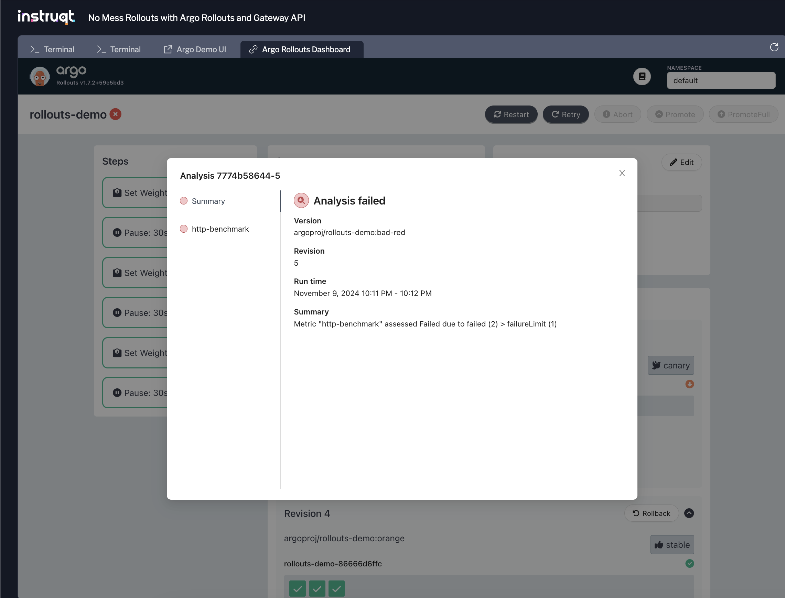

Next we will explore how Argo Rollouts can support Job-based metrics based analysis for rollouts.

Instead of relying on the underlying provider to emit metrics, we will use a Kubernetes Job that emits metrics.

## Create an Analysis Template
===============

While the rollout will traverse through the steps of shifting the traffic by updating the weights, we'll now add an analysis to run as part of the canary deployment. This analysis step will use the `argoproj/load-tester` job metric provider to run wrk (https://github.com/wg/wrk), an HTTP benchmarking tool, against the supplied hostname
and then interprets the error rate for success or failure.

Remember from the Istio Rollout example with metrics, Argo provides a [AnalysisTemplate](https://argoproj.github.io/argo-rollouts/features/analysis/) resource which defines how to perform a canary analysis, such as the metrics which it should perform, its frequency, and the values which are considered successful or failed. This time instead of relying on metrics from our gateway, we will use the metrics emitted from the Kubernetes Job.

Let's take a look at the Job-based AnalysisTemplate:
```bash,run
cat labs/08/analysis-template.yaml | yq
```

Notice the analysis we're using to calculate the `error_ratio`:
```,nocopy
  wrk -t1 -c1 -d5 -s report.lua http://{{args.host}}/color
  jq -e '.errors_ratio <= 0.05' report.json
```

Apply the config:
```bash,run
kubectl apply -f labs/08/analysis-template.yaml
```

## Configure Analysis in Your Rollout
===============

Deploy your rollout with the Job Analysis metrics configured:
```bash,run
cat labs/08/job-metrics-rollout.yaml | yq
```

Apply the config:
```bash,run
kubectl apply -f labs/08/job-metrics-rollout.yaml
```

This will trigger Argo to create an `AnalysisRun`. View the created `AnalysisRun`:
```bash,run
kubectl get analysisrun
```

You should get something that looks like:
```,nocopy
NAME                         STATUS    AGE
rollouts-demo-687d76d795-5   Running   8s
```

## Monitor Rollouts
===============

Check the status of the rollout:
```bash,run
kubectl argo rollouts get rollout rollouts-demo
```

You should get something that looks like:
```,nocopy
Name:            rollouts-demo
Namespace:       default
Status:          ॥ Paused
Message:         CanaryPauseStep
Strategy:        Canary
  Step:          1/6
  SetWeight:     30
  ActualWeight:  30
Images:          argoproj/rollouts-demo:orange (canary)
                 argoproj/rollouts-demo:purple (stable)
Replicas:
  Desired:       3
  Current:       4
  Updated:       1
  Ready:         4
  Available:     4

NAME                                                              KIND         STATUS        AGE    INFO
⟳ rollouts-demo                                                   Rollout      ॥ Paused      10h
├──# revision:10
│  ├──⧉ rollouts-demo-86666d6ffc                                  ReplicaSet   ✔ Healthy     20s    canary
│  │  └──□ rollouts-demo-86666d6ffc-sckbp                         Pod          ✔ Running     20s    ready:1/1
│  └──α rollouts-demo-86666d6ffc-10                               AnalysisRun  ◌ Running     18s    ✔ 1
│     ├──⊞ e6bc17e5-521f-497a-ae0d-4f7692c604f5.http-benchmark.1  Job          ✔ Successful  18s
│     └──⊞ e6bc17e5-521f-497a-ae0d-4f7692c604f5.http-benchmark.2  Job          ◌ Running     4s
```

You can view the result of the analysis by looking at the status:
```bash,run
kubectl describe analysisrun
```

You should see something like this:
```,nocopy
Status:
  Completed At:  2024-11-07T04:36:43Z
  Dry Run Summary:
  Message:  Run Terminated
  Metric Results:
    Count:  8
    Measurements:
      Finished At:  2024-11-07T04:35:20Z
      Metadata:
        Job - Name:       e6bc17e5-521f-497a-ae0d-4f7692c604f5.http-benchmark.1
        Job - Namespace:  default
      Phase:              Successful
      Started At:         2024-11-07T04:35:11Z
      Finished At:        2024-11-07T04:35:33Z
      Metadata:
        Job - Name:       e6bc17e5-521f-497a-ae0d-4f7692c604f5.http-benchmark.2
        Job - Namespace:  default
      Phase:              Successful
      Started At:         2024-11-07T04:35:25Z
      Finished At:        2024-11-07T04:35:46Z
      Metadata:
        Job - Name:       e6bc17e5-521f-497a-ae0d-4f7692c604f5.http-benchmark.3
        Job - Namespace:  default
      Phase:              Successful
      Started At:         2024-11-07T04:35:38Z
      Finished At:        2024-11-07T04:35:59Z
      Metadata:
        Job - Name:       e6bc17e5-521f-497a-ae0d-4f7692c604f5.http-benchmark.4
        Job - Namespace:  default
      Phase:              Successful
      Started At:         2024-11-07T04:35:51Z
      Finished At:        2024-11-07T04:36:12Z
      Metadata:
        Job - Name:       e6bc17e5-521f-497a-ae0d-4f7692c604f5.http-benchmark.5
        Job - Namespace:  default
      Phase:              Successful
      Started At:         2024-11-07T04:36:04Z
      Finished At:        2024-11-07T04:36:25Z
      Metadata:
        Job - Name:       e6bc17e5-521f-497a-ae0d-4f7692c604f5.http-benchmark.6
        Job - Namespace:  default
      Phase:              Successful
      Started At:         2024-11-07T04:36:17Z
      Finished At:        2024-11-07T04:36:38Z
      Metadata:
        Job - Name:       e6bc17e5-521f-497a-ae0d-4f7692c604f5.http-benchmark.7
        Job - Namespace:  default
      Phase:              Successful
      Started At:         2024-11-07T04:36:30Z
      Finished At:        2024-11-07T04:36:43Z
      Message:            Metric Terminated
      Metadata:
        Job - Name:       e6bc17e5-521f-497a-ae0d-4f7692c604f5.http-benchmark.8
        Job - Namespace:  default
      Phase:              Successful
      Started At:         2024-11-07T04:36:43Z
    Message:              Metric Terminated
    Name:                 http-benchmark
    Phase:                Successful
    Successful:           8
  Phase:                  Successful
  Run Summary:
    Count:       1
    Successful:  1
  Started At:    2024-11-07T04:35:11Z
Events:
  Type    Reason                 Age   From                 Message
  ----    ------                 ----  ----                 -------
  Normal  MetricSuccessful       19s   rollouts-controller  Metric 'http-benchmark' Completed. Result: Successful
  Normal  AnalysisRunSuccessful  19s   rollouts-controller  Analysis Completed. Result: Successful
```


First setup the environment based on the provider you choose before:
```bash,run
if kubectl get namespace gloo-system &> /dev/null; then
    export GW_NAMESPACE="default"
    export GW_SVC_NAME="gloo-proxy-gw"
    export GW_ADDRESS=$(kubectl get svc -n $GW_NAMESPACE $GW_SVC_NAME -o jsonpath='{.status.loadBalancer.ingress[0].ip}')
elif kubectl get namespace envoy-gateway-system &> /dev/null; then
    export GW_NAMESPACE="envoy-gateway-system"
    export GW_SVC_NAME="$(kubectl get svc -n $GW_NAMESPACE -l gateway.envoyproxy.io/owning-gateway-name=gw -o jsonpath='{.items[0].}')"
    export GW_ADDRESS=$(kubectl get svc -n $GW_NAMESPACE $GW_SVC_NAME -o jsonpath='{.items[0].status.loadBalancer.ingress[0].ip}')
elif kubectl get namespace nginx-gateway &> /dev/null; then
    export GW_NAMESPACE="nginx-gateway"
    export GW_SVC_NAME="ngf-nginx-gateway-fabric"
    export GW_ADDRESS=$(kubectl get svc -n $GW_NAMESPACE $GW_SVC_NAME -o jsonpath='{.status.loadBalancer.ingress[0].ip}')
else
    export GW_NAMESPACE="default"
fi
```

Then send the curl request:
```bash,run
for i in {1..100}; do
  curl "$GW_ADDRESS:80/color"
  echo
done
```

You should get only "orange" responses once the canary version is promoted:
```,nocopy
"orange"
"orange"
"orange"
"orange"
"orange"
"orange"
"orange"
```

## Increase Error Rate
===============

Let's add some chaos to our system! Update the image:
```bash,run
kubectl argo rollouts set image rollouts-demo rollouts-demo=argoproj/rollouts-demo:bad-red
```

Uh-oh! It turns out the "red" version we are going to upgrade has a regression (We will be using a high error rate images, prefixed with the word `bad`, in this case `bad-red`).

Check the progress of the rollout using the `kubectl argo` plugin:
```bash,run
kubectl argo rollouts get rollout rollouts-demo
```

You should get something that looks like this when the AnalysisRun fails:
```,nocopy
Name:            rollouts-demo
Namespace:       default
Status:          ॥ Paused
Message:         CanaryPauseStep
Strategy:        Canary
  Step:          1/6
  SetWeight:     30
  ActualWeight:  30
Images:          argoproj/rollouts-demo:bad-red (canary)
                 argoproj/rollouts-demo:orange (stable)
Replicas:
  Desired:       3
  Current:       4
  Updated:       1
  Ready:         4
  Available:     4

NAME                                                              KIND         STATUS        AGE    INFO
⟳ rollouts-demo                                                   Rollout      ॥ Paused      7m24s
├──# revision:3
│  ├──⧉ rollouts-demo-7774b58644                                  ReplicaSet   ✔ Healthy     21s    canary
│  │  └──□ rollouts-demo-7774b58644-752gg                         Pod          ✔ Running     21s    ready:1/1
│  └──α rollouts-demo-7774b58644-3                                AnalysisRun  ◌ Running     18s    ✖ 1
│     ├──⊞ f82ea56b-f0f8-4856-b217-636b7d546776.http-benchmark.1  Job          ✖ Failed      18s
│     └──⊞ f82ea56b-f0f8-4856-b217-636b7d546776.http-benchmark.2  Job          ◌ Running     4s
├──# revision:2
│  ├──⧉ rollouts-demo-86666d6ffc                                  ReplicaSet   ✔ Healthy     3m36s  stable
│  │  ├──□ rollouts-demo-86666d6ffc-5ggdn                         Pod          ✔ Running     3m36s  ready:1/1
│  │  ├──□ rollouts-demo-86666d6ffc-8zznr                         Pod          ✔ Running     3m4s   ready:1/1
│  │  └──□ rollouts-demo-86666d6ffc-6wzdd                         Pod          ✔ Running     2m34s  ready:1/1
│  └──α rollouts-demo-86666d6ffc-2                                AnalysisRun  ✔ Successful  3m34s  ✔ 7
│     ├──⊞ ea4c48f5-5df2-4924-b817-593ae6527b51.http-benchmark.1  Job          ✔ Successful  3m34s
│     ├──⊞ ea4c48f5-5df2-4924-b817-593ae6527b51.http-benchmark.2  Job          ✔ Successful  3m17s
│     ├──⊞ ea4c48f5-5df2-4924-b817-593ae6527b51.http-benchmark.3  Job          ✔ Successful  3m4s
│     ├──⊞ ea4c48f5-5df2-4924-b817-593ae6527b51.http-benchmark.4  Job          ✔ Successful  2m51s
│     ├──⊞ ea4c48f5-5df2-4924-b817-593ae6527b51.http-benchmark.5  Job          ✔ Successful  2m38s
│     ├──⊞ ea4c48f5-5df2-4924-b817-593ae6527b51.http-benchmark.6  Job          ✔ Successful  2m25s
│     └──⊞ ea4c48f5-5df2-4924-b817-593ae6527b51.http-benchmark.7  Job          ✔ Successful  2m12s
└──# revision:1
   └──⧉ rollouts-demo-7d9c645dbb                                  ReplicaSet   • ScaledDown  7m24s
```

To view the Argo Rollouts Dashboard UI, switch to [Terminal 2](tab-1) and run the following command in the namespace that contains your Rollouts:
```bash,run
kubectl argo rollouts dashboard
```

In the Argo Dashboard UI you should get something like this:


> [!IMPORTANT]
> If you do not see an error in the analysis run, make sure your rollout has the `bad-` prefix appended on the image.

What happened? Argo Rollouts automatically handles rollbacks if the analysis fails. If the success condition specified in the analysis template is not met, the rollout will revert to the last stable version.

Looking at the UI you should see the canary upgrade was reverted to the original color.

You can port-forward your gateway provider:
```bash
kubectl port-forward service/$GW_SVC_NAME -n $GW_NAMESPACE 8080:80 --address 0.0.0.0
```


You can confirm this manually by sending the same curl request through the gateway as before.
```bash,run
for i in {1..100}; do
  curl "$GW_ADDRESS:80/color"
  echo
done
```

Once the rollback is finished, you should only get the "orange" response:
```,nocopy
"orange"
"orange"
"orange"
"orange"
"orange"
"orange"
"orange"
```

You can also view the results of the rollout in the Argo Rollouts Dashboard:


From there you can view the report on the failed AnalysisRun:


🏁 Finish
=========

Great job! You have now automated your rollout in a way that's generic across all the Gateway API providers, regardless of the metrics they emit.