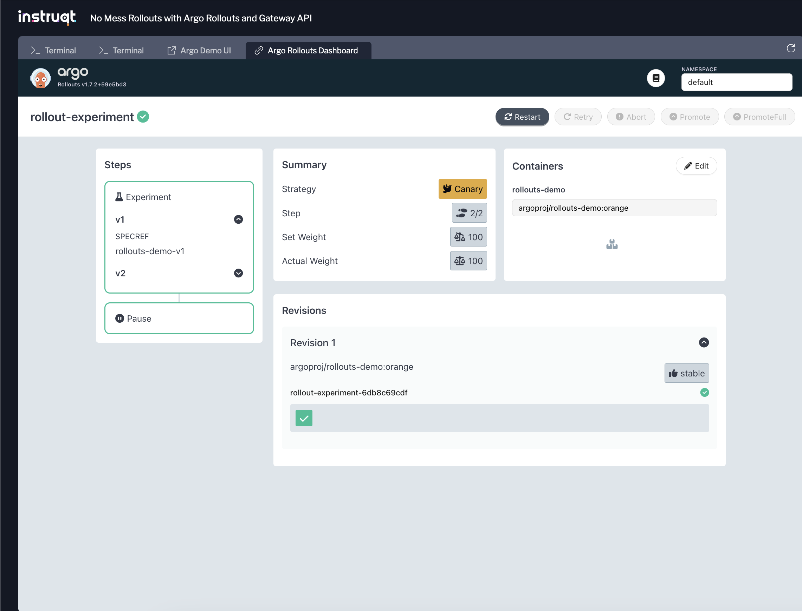

Next we will use look at using an Argo [Experiment](https://argo-rollouts.readthedocs.io/en/stable/features/experiment/) with our Job-based metrics. An Experiment resource allows for temporary runs of one or more ReplicaSets. This is useful for testing new application versions in isolation by deploying them under unique labels, ensuring they won’t receive traffic from the main Kubernetes service. You can then validate the new version’s performance and behavior before rolling it out.

An Argo Experiment does not require a Rollout to run. Experiments in Argo are standalone resources that you can use independently to test various configurations, measure specific metrics, or evaluate different versions of an application in isolation.

Using an Experiment alone is ideal if want to measure the performance or behavior of an application version without affecting live traffic, or you need to benchmark different service versions in a controlled way before rolling out changes.

Create Two Versions of the Demo Application
===============

Let’s start by creating two versions, `v1` and `v2`, of our demo application. This will enable us to perform A/B testing:
```bash,run
kubectl apply -f labs/09/a-b-testing-services.yaml
```

Create an AnalysisTemplate
===============

We will reuse the `argoproj/load-tester` job metric provider to run wrk (https://github.com/wg/wrk), an HTTP benchmarking tool, against the supplied hostname to calculate an error rate.
```bash,run
cat labs/09/analysis-template.yaml | yq
```


Make sure the AnalysisTemplate resource is still applied:
```bash,run
kubectl apply -f labs/09/analysis-template.yaml
```

Create an Experiment 🔎
===============

Now, let’s create an Experiment resource to run both versions in parallel and evaluate their performance:

```bash,run
cat labs/09/argo-experiment.yaml | yq
```

Notice the v2 version is using the `bad-orange` version of the image with a high error rate.

Let's apply the config:
```bash,run
kubectl apply -f labs/09/argo-experiment.yaml
```

View the created experiment by listing the associated pods:
```bash,run
kubectl get pods -n default
```

Example output:
```,nocopy
NAME                                                          READY   STATUS      RESTARTS   AGE
507707ca-1fea-48bf-822d-c82c53be43b0.http-benchmark.1-mss9v   0/1     Completed   0          26s
507707ca-1fea-48bf-822d-c82c53be43b0.http-benchmark.2-db8tl   0/1     Error       0          12s
c1440445-b237-4d10-93f7-f0e8f995a3bc.http-benchmark.1-jdkw5   0/1     Error       0          26s
c1440445-b237-4d10-93f7-f0e8f995a3bc.http-benchmark.2-6j72k   0/1     Completed   0          12s
experiment-demo-v1-92lbp                                      1/1     Running     0          86s
experiment-demo-v1-gqbgt                                      1/1     Running     0          86s
experiment-demo-v2-6n2j9                                      1/1     Running     0          86s
experiment-demo-v2-g4slh                                      1/1     Running     0          86s
```

Review the Results of the Experiment
===============

Once the experiment has completed, you can check the logs of individual benchmarking jobs to view the wrk test results:
```
kubectl logs 507707ca-1fea-48bf-822d-c82c53be43b0.http-benchmark.1-mss9v
```

Example log output:
```,nocopy
+ wrk -t1 -c1 -d5 -s report.lua http://rollouts-demo-v1/color        Running 5s test @ http://rollouts-demo-v1/color                        1 threads and 1 connections                                              Thread Stats   Avg      Stdev     Max   +/- Stdev                          Latency    25.98us   21.11us   1.73ms   98.73%                           Req/Sec    38.65k     3.25k   42.82k    72.55%                         196022 requests in 5.10s, 29.35MB read                                 Requests/sec:  38436.55                                                  Transfer/sec:      5.75MB
```

Detailed JSON output with error rates and performance metrics:
```json,nocopy
{
  "duration_seconds":5.10,
  "requests_total":196022,
  "requests_per_second":38436.55,
  "transfer_bytes_total":30775454,
  "transfer_bytes_per_second":6034538.82,
  "errors_total":0,
  "errors_ratio":0.00,
  "latency_min_ms":0.02,
  "latency_max_ms":1.73,
  "latency_avg_ms":0.03,
  "latency_stdev_ms":0.02
}
```

```,nocopy
jq -e .errors_ratio <= 0.05 report.json                                true
```

A true result indicates the experiment’s error rate is within the acceptable range, marking it as a success.

We can check this matches the status of the experiment:
```bash,run
kubectl describe Experiment -l experiment=demo
```

You should see the results of the `Analysis Runs` on the status:
```,nocopy
Status:
  Analysis Runs:
    Analysis Run:  experiment-demo-v1
    Name:          v1
    Phase:         Running
    Analysis Run:  experiment-demo-v2
    Name:          v2
    Phase:         Running
  Available At:    2024-11-10T05:15:45Z
  Conditions:
    Last Transition Time:  2024-11-10T05:15:22Z
    Last Update Time:      2024-11-10T05:15:45Z
    Message:               Experiment "experiment-demo" is running.
    Reason:                NewReplicaSetAvailable
    Status:                True
    Type:                  Progressing
  Phase:                   Running
  Template Statuses:
    Available Replicas:    2
    Last Transition Time:  2024-11-10T05:15:45Z
    Name:                  v1
    Ready Replicas:        2
    Replicas:              2
    Status:                Running
    Updated Replicas:      2
    Available Replicas:    2
    Last Transition Time:  2024-11-10T05:15:37Z
    Name:                  v2
    Ready Replicas:        2
    Replicas:              2
    Status:                Running
    Updated Replicas:      2
Events:
  Type    Reason               Age    From                 Message
  ----    ------               ----   ----                 -------
  Normal  TemplateProgressing  2m20s  rollouts-controller  Template 'v1' transitioned from  -> Progressing
  Normal  TemplateProgressing  2m20s  rollouts-controller  Template 'v2' transitioned from  -> Progressing
  Normal  ExperimentPending    2m20s  rollouts-controller  Experiment transitioned from  -> Pending
  Normal  ScalingReplicaSet    2m20s  rollouts-controller  Scaled up ReplicaSet experiment-demo-v1 from 0 to 2
  Normal  ScalingReplicaSet    2m20s  rollouts-controller  Scaled up ReplicaSet experiment-demo-v2 from 0 to 2
  Normal  TemplateRunning      2m5s   rollouts-controller  Template 'v2' transitioned from Progressing -> Running
  Normal  TemplateRunning      117s   rollouts-controller  Template 'v1' transitioned from Progressing -> Running
  Normal  ExperimentRunning    117s   rollouts-controller  Experiment transitioned from Pending -> Running
  Normal  AnalysisRunPending   117s   rollouts-controller  AnalysisRun 'v1' transitioned from  -> Pending
  Normal  AnalysisRunPending   117s   rollouts-controller  AnalysisRun 'v2' transitioned from  -> Pending
  Normal  AnalysisRunRunning   117s   rollouts-controller  AnalysisRun 'v1' transitioned from Pending -> Running
  Normal  AnalysisRunRunning   117s   rollouts-controller  AnalysisRun 'v2' transitioned from  -> Running
```

Advanced Exercises 💪
===============

Want more Argo Rollouts and Gateway API? We have you covered! Here are some self-guided tasks you can try on your own using your new Rollouts knowledge!

### Task One: Create a Rollout that only proceeds if the Experiment is a success

Although Experiments can be used as standalone resources in Argo, you can also integrate Experiments with Rollouts.

During an update of a Rollout, the Rollout will launch an Experiment. The Experiment will create two ReplicaSets: baseline and canary, with one replica each, and will run for a set duration. The baseline template uses the PodSpec from the stable ReplicaSet, and the canary template uses the PodSpec from the canary ReplicaSet.

A rollout using the Canary strategy can create an experiment using an `experiment` step. The experiment step serves as a blocking step for the Rollout, and a Rollout will not continue until the Experiment succeeds. The Rollout creates an Experiment using the configuration defined in the experiment step of the Rollout. If the Experiment fails or errors, the Rollout will abort.

You will need an Experiment section in the Rollout:
```yaml,nocopy
  strategy:
    canary:
      steps:
      - experiment:
          duration: 5m
          templates:
          - name: v1
            specRef: rollouts-demo-v1
          - name: v2
            specRef: rollouts-demo-v2
          analyses:
          - name: v1
            templateName: http-benchmark
            requiredForCompletion: true
            args:
            - name: host
              value: rollouts-demo-v1
          - name: v2
            templateName: http-benchmark
            requiredForCompletion: true
            args:
            - name: host
              value: rollouts-demo-v2
      - pause: {}
```

> [!NOTE]
> Hint: You will need to create a new Rollout. Check out the [example on integrating experiments with rollouts](https://argoproj.github.io/argo-rollouts/features/experiment/#integration-with-rollouts) from the Argo docs.

You can view the Experiment in the Argo Dashboard UI:


### Task Two: Create a Latency-based Experiment

The previous Experiment we ran relied on the `errors_ratio`. Design a new AnalysisTemplate based on the latency metrics in the report.json coming from the wrk HTTP benchmarking Job:

> [!NOTE]
> Hint: Remember the resport has these metrics available for you to use
>```
>  "latency_min_ms":0.02,
>  "latency_max_ms":1.73,
>  "latency_avg_ms":0.03,
>  "latency_stdev_ms":0.02
>```

In addition to supporting the `bad-` prefix, you can use the `slow-` prefix for image to use a high latency images (ex. `argoproj/rollouts-demo:slow-yellow`). You can update the Experiment template to use a high latency image for testing.

### Task Three: Create an Experiment with Multiple Metrics

Design a composite AnalysisTemplate that evaluates both latency and error rates simultaneously to provide a more comprehensive performance assessment. You could set conditions where both latency_avg_ms should stay below a certain threshold and errors_ratio should stay under a specific percentage.

> [!NOTE]
> Hint: In the AnalysisTemplate, ?combine conditions, for example:
>```
>    latency_avg_ms < 0.1
>    errors_ratio < 0.05
>```

This can help uncover potential trade-offs, such as whether optimizing for latency negatively impacts the error rate.
